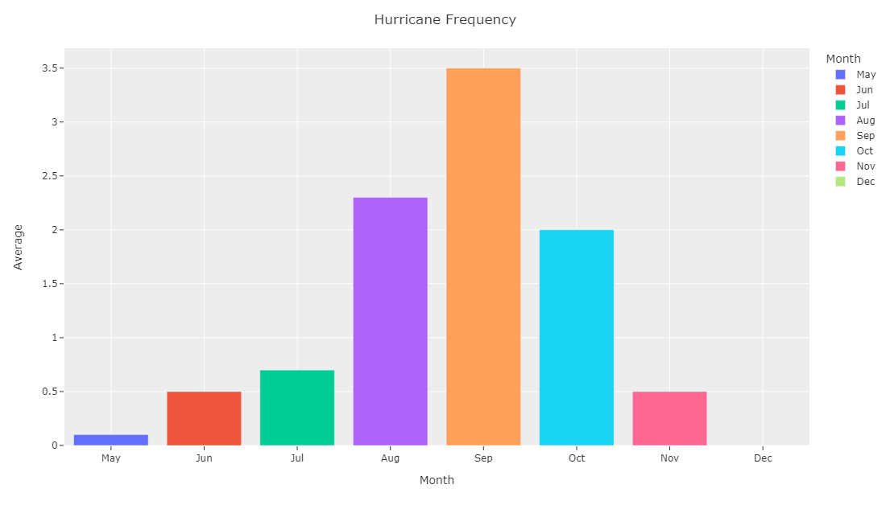
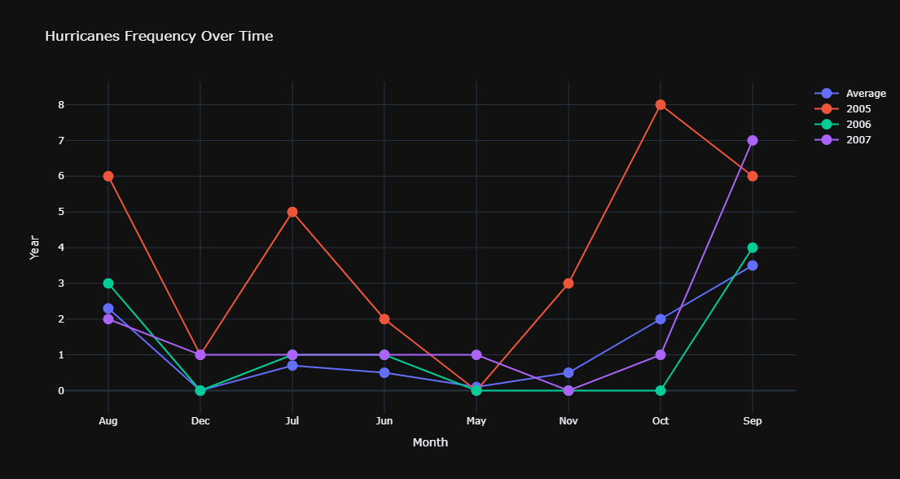
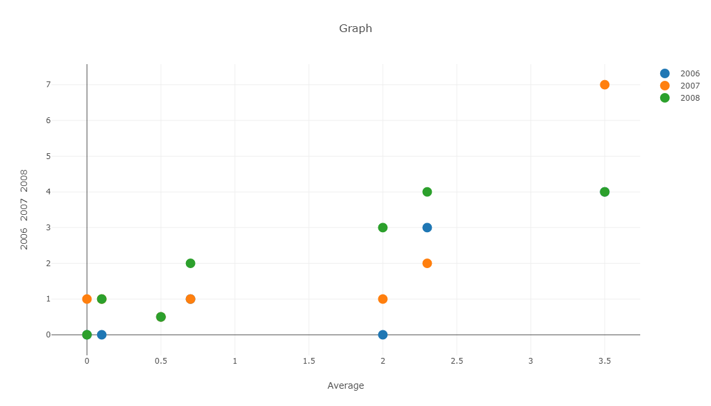
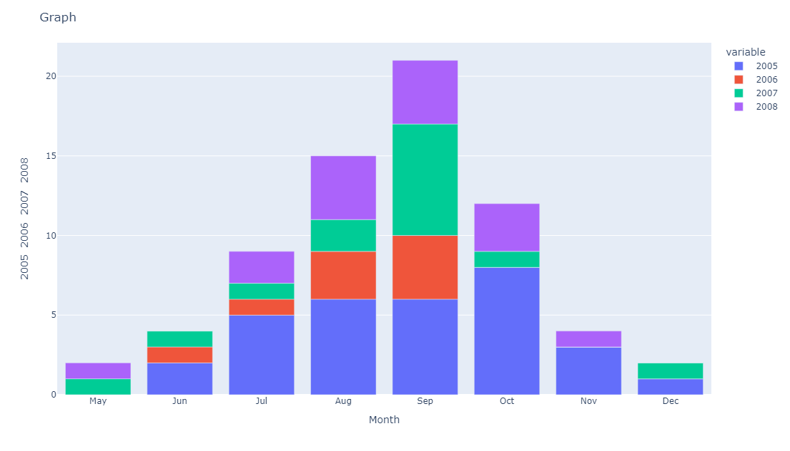

# Graph Dashly

* Check it out here [https://graph-dashly.herokuapp.com/](https://graph-dashly.herokuapp.com/)

### Description
* Graph Dashly is a simple, quick, and free website that allows users to create customizable charts and diagrams online with Excel or CSV data and view their data for any data analysis purposes. Users can customize their graphs with over 10+ features including filtering data with their own SQL queries, creating graphs with a variety of graph types, and more. Additionally, users can create an account, letting them save save and view past graphs as well as save SQL queries on the site.

### Technologies
* The graphing elements and interface were implemented using Python and its Dash and Plotly libraries. Utilized the dash-auth package for account setup. User information and data stored within SQLite database.

     
    
